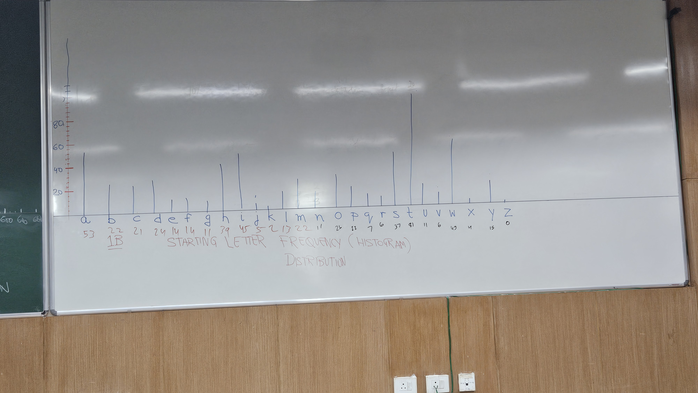
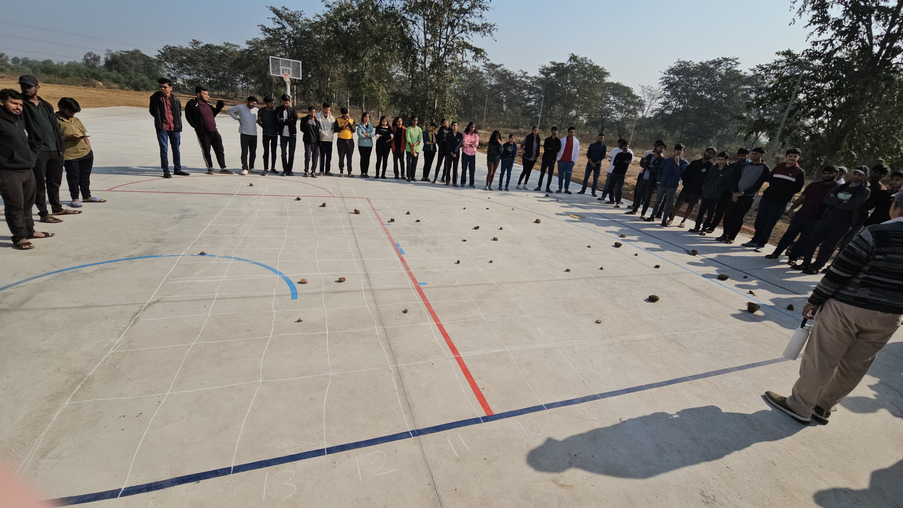

Lecture-1 Notes 
---

## Introduction

### Notes on Plotting Histograms and Heatmaps

---

### 1. Histograms

A histogram is a graphical representation of the distribution of data. It divides the entire range of values into intervals (called bins) and counts the number of data points that fall into each bin.

#### Mathematical Definition

Let be the data points. Divide the range of data into bins, where:
The bin width is:

w = max(x) - min(x) k
bi ≤ x < bi+1 

Here, and are the edges of the -th bin.
Steps to Plot a Histogram:-

1. Choose the number of bins: Use the rule of thumb or algorithms like the
Sturges’ formula:

k = ⌈log2(n) + 1⌉
3. Plot the frequencies using bar heights.

#### Python Code Example

```python
import matplotlib.pyplot as plt
import numpy as np

# Sample data
data = np.random.normal(0, 1, 1000)

# Plotting the histogram
plt.hist(data, bins=30, edgecolor='black', alpha=0.7)
plt.title('Histogram')
plt.xlabel('Value')
plt.ylabel('Frequency')
plt.show()
```


---

#### Activity on Histograms

**Part A: Word Length Histogram**

**Objective:** Create a histogram that represents the frequency of words based on their length in any paragraph from your preferred book.

**Steps:**

1. Choose a paragraph from your favorite book.
2. Count the number of letters in each word.
3. Group words by their lengths (e.g., words with 1 letter, 2 letters, etc.).
4. Plot the histogram:
   - **X-axis:** Word lengths.
   - **Y-axis:** Frequency of words of each length.
  


**Part B: Starting Letter Histogram**

**Objective:** Create a histogram to analyze the frequency of words starting with each letter of the alphabet.

**Steps:**

1. Use the same paragraph as in Part A.
2. Count how many words start with each letter (A-Z).
3. Plot the histogram:
   - **X-axis:** Starting letters (A-Z).
   - **Y-axis:** Frequency of words starting with each letter.




**Part C: Forecasting with Weight and Height Functions**

**Objective:** Plot histograms using functions for weight and height over time.

**Functions:**

Define the following functions:
w(t) = t + 2, (Weight function)
h(t) = 3t + 5, (Height function)
where t represents time (from the beginning to today).
Steps
1. Create data points for different values of t (e.g., t = 0, 1, 2, . . .).
2. Calculate w(t) and h(t) for each t.
3. Plot the histogram using:
• X-axis: Time (t).
• Y-axis: Weight (w(t)) or Height (h(t)). 

 


- [Histogram Video](https://drive.google.com/file/d/1g_NWFWEwnrwKtEe_6Ub3wr88oSFAZrdw/view?usp=drive_link)

---

### 2. Heatmaps

A heatmap is a data visualization technique used to represent data in a matrix format with varying intensities of color to show magnitude.

#### Mathematical Definition

For a matrix with elements , a heatmap assigns a color to each cell based on
a colormap :
cij = C(aij )

#### Steps to Create a Heatmap

1. Normalize the data: Rescale values if needed.
2. Choose a colormap: Maps numerical values to colors.
3. Visualize the data as a grid.

#### Python Code Example

```python
import seaborn as sns
import numpy as np
import matplotlib.pyplot as plt

# Sample data
data = np.random.rand(10, 10)

# Plotting the heatmap
sns.heatmap(data, annot=True, cmap='viridis')
plt.title('Heatmap')
plt.show()
```


---

### 3. Vectors and the Tug of War Problem

#### Vectors 

A vector is a quantity that has both magnitude and direction. It can be
represented in the Cartesian coordinate system with components along the x,
y, and z axes.

For example, a vector⃗ A in two-dimensional space can be written as:⃗
A = Axˆi + Ayˆj
where: - Ax and Ay are the components of the vector along the x and y
axes, respectively. - ˆi and ˆj are the unit vectors along the x and y axes.


#### Tug of War Problem

Three people pull a rope with forces: 

- \(\vec{F}_1 = 10 \hat{i} + 5 \hat{j}\) Newtons.
- \(\vec{F}_2 = -8 \hat{i} + 7 \hat{j}\) Newtons.
- \(\vec{F}_3 = 3 \hat{i} - 6 \hat{j}\) Newtons.

**Net Force:**

\(\vec{F}_{\text{net}} = \vec{F}_1 + \vec{F}_2 + \vec{F}_3\)

**Magnitude:**

\(|\vec{F}_{\text{net}}| = \sqrt{(5)^2 + (6)^2}\)

**Direction:**

\(\theta = \tan^{-1} \left( \frac{6}{5} \right)\)

#### Python Implementation

```python
import numpy as np

# Forces
F1 = np.array([10, 5])
F2 = np.array([-8, 7])
F3 = np.array([3, -6])

# Net force
net_force = F1 + F2 + F3

# Magnitude and direction
magnitude = np.linalg.norm(net_force)
direction = np.degrees(np.arctan2(net_force[1], net_force[0]))

print("Net Force:", net_force)
print("Magnitude:", magnitude)
print("Direction:", direction)
```


---

### Additional Resources

- [Heatmap Video](https://drive.google.com/file/d/1VlTeJLOTASAtO9nbkH_QxsGp8jWv7EO0/view?usp=drive_link)
- [Tug of War Video](https://drive.google.com/file/d/1VlTeJLOTASAtO9nbkH_QxsGp8jWv7EO0/view?usp=drive_link)
- [Conditional Probability Video](https://drive.google.com/file/d/1J6ZlfSrlUJupLeQZTIPitkgY0OLLZeeK/view?usp=drive_link)

---

### Conditional Probability

Conditional probability is the probability of an event \(A\) occurring given that another event \(B\) has occurred:

\(P(A | B) = \frac{P(A \cap B)}{P(B)}\)

#### Dice Experiment

Let’s consider a dice experiment. We roll a standard 6-sided die and define:

- **Event A**: The die shows an even number (2, 4, or 6).
- **Event B**: The die shows a number greater than 3 (4, 5, or 6).

#### Step-by-Step Calculation

1. **Sample Space**: \(S = \{1, 2, 3, 4, 5, 6\}\)
2. **Probability of Event B**: \(P(B) = \frac{3}{6} = 0.5\)
3. **Intersection of Events A and B**: \(P(A \cap B) = \frac{2}{6} = 0.3333\)
4. **Conditional Probability Formula**:

\(P(A | B) = \frac{P(A \cap B)}{P(B)} = \frac{2/6}{3/6} = \frac{2}{3}\)

#### Python Code Example

```python
import numpy as np

# Define the sample space and events
sample_space = [1, 2, 3, 4, 5, 6]
A = [2, 4, 6]  # Even numbers
B = [4, 5, 6]  # Numbers greater than 3

# Calculate intersection
intersection_A_B = list(set(A) & set(B))

# Probabilities
P_B = len(B) / len(sample_space)
P_A_intersection_B = len(intersection_A_B) / len(sample_space)

# Conditional probability
P_A_given_B = P_A_intersection_B / P_B

print("P(A | B):", P_A_given_B)
```

**Output:**

```
P(A | B): 0.6666666666666666
```

  


[Conditional Probability video](https://drive.google.com/file/d/1w9gS_nut-K0EZZ5SGK8UsKN_qbwcPaBN/view?usp=drive_link) 

