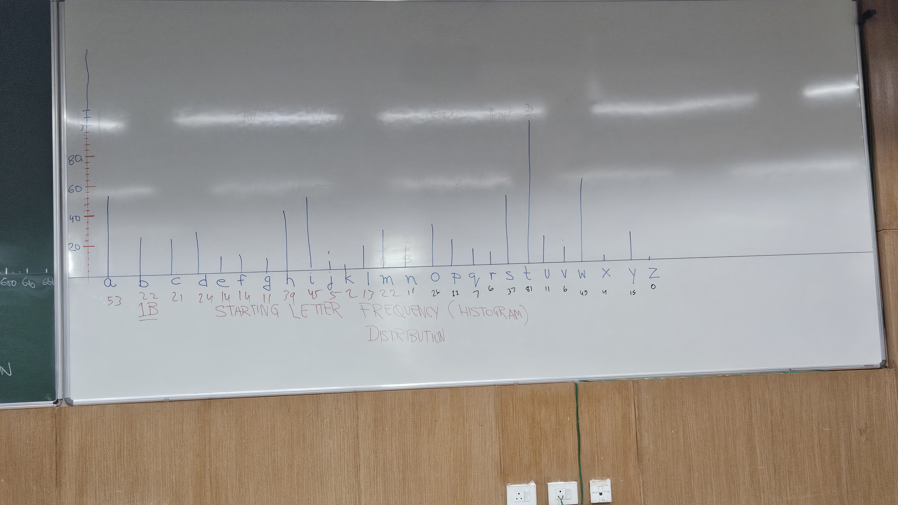

Lecture-1 Notes 
---
### HISTOGTRAM
## Introduction

### Notes on Plotting Histograms and Heatmaps

---

### 1. Histograms

A histogram is a graphical representation of the distribution of data. It divides the entire range of values into intervals (called bins) and counts the number of data points that fall into each bin.

#### Mathematical Definition

Let be the data points. Divide the range of data into bins, where:
The bin width is:

w = max(x) - min(x) k
bi ≤ x < bi+1 

Here, and are the edges of the -th bin.
Steps to Plot a Histogram:-

1. Choose the number of bins: Use the rule of thumb or algorithms like the
Sturges’ formula:

k = ⌈log2(n) + 1⌉
3. Plot the frequencies using bar heights.

#### Python Code Example

```python
import matplotlib.pyplot as plt
import numpy as np

# Sample data
data = np.random.normal(0, 1, 1000)

# Plotting the histogram
plt.hist(data, bins=30, edgecolor='black', alpha=0.7)
plt.title('Histogram')
plt.xlabel('Value')
plt.ylabel('Frequency')
plt.show()
```


---

#### Activity on Histograms

**Part A: Word Length Histogram**

**Objective:** Create a histogram that represents the frequency of words based on their length in any paragraph from your preferred book.

**Steps:**

1. Choose a paragraph from your favorite book.
2. Count the number of letters in each word.
3. Group words by their lengths (e.g., words with 1 letter, 2 letters, etc.).
4. Plot the histogram:
   - **X-axis:** Word lengths.
   - **Y-axis:** Frequency of words of each length.
  


**Part B: Starting Letter Histogram**

**Objective:** Create a histogram to analyze the frequency of words starting with each letter of the alphabet.

**Steps:**

1. Use the same paragraph as in Part A.
2. Count how many words start with each letter (A-Z).
3. Plot the histogram:
   - **X-axis:** Starting letters (A-Z).
   - **Y-axis:** Frequency of words starting with each letter.




**Part C: Forecasting with Weight and Height Functions**

**Objective:** Plot histograms using functions for weight and height over time.

**Functions:**

Define the following functions:
w(t) = t + 2, (Weight function)
h(t) = 3t + 5, (Height function)
where t represents time (from the beginning to today).
Steps
1. Create data points for different values of t (e.g., t = 0, 1, 2, . . .).
2. Calculate w(t) and h(t) for each t.
3. Plot the histogram using:
• X-axis: Time (t).
• Y-axis: Weight (w(t)) or Height (h(t)). 

 


---


- [Histogram Video](https://drive.google.com/file/d/1g_NWFWEwnrwKtEe_6Ub3wr88oSFAZrdw/view?usp=drive_link)

---


